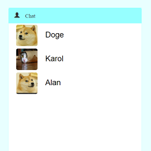
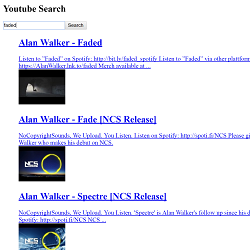
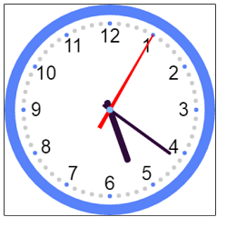
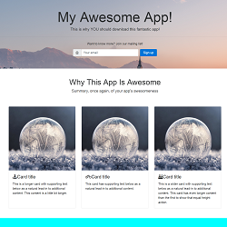
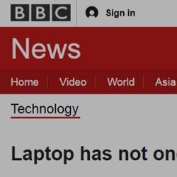
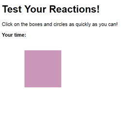
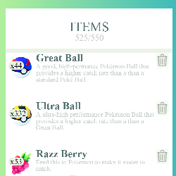
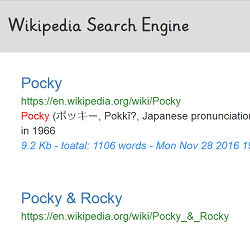
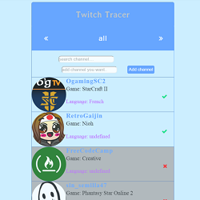
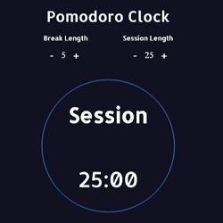

###Testcase

####CSS
CSS practice
These are some of my CSS practice .

| 項目  |  Repository  |  Demo
 --- | --- | --- 
 the practice of  bbc clone page   | [Repository](https://github.com/arcobalenoi27/complete-web-developer-course/tree/master/2-css/12.bbc) |  [Click here !](https://arcobalenoi27.github.io/complete-web-developer-course/2-css/12.bbc/)
 Pokémon go-like UI   | [Repository](https://github.com/arcobalenoi27/complete-web-developer-course/tree/master/css-layout-practice/pokemon-ui-itemList-RWD) |  [Click here !](https://arcobalenoi27.github.io/complete-web-developer-course/css-layout-practice/pokemon-ui-itemList-RWD/)
####Simple reaction game
It is a simple game to test your reactions.

 項目  |  Repository  |  Demo
 --- | --- | --- 
 Test your reactions | [Repository](https://github.com/arcobalenoi27/complete-web-developer-course/tree/master/3-javascript/15.external%20javascript) |  [Click here !](https://arcobalenoi27.github.io/complete-web-developer-course/3-javascript/15.external%20javascript/)
 
####Canvas
It is a clock that I use HTML5 Canvas to build.

 項目  |  Repository  |  Demo
 --- | --- | --- 
 Animated clock | [Repository](https://github.com/arcobalenoi27/canvas-practice/tree/master/clock-with-canvas) |  [Click here !](https://arcobalenoi27.github.io/canvas-practice/clock-with-canvas/)
####Bootstrap
It is a simple landing page that I use Bootstrap 4 (Alpha 6) to build.

 項目  |  Repository  |  Demo
 --- | --- | --- 
 Landing page | [Repository](https://github.com/arcobalenoi27/complete-web-developer-course/tree/master/5-Bootstrap4) |  [Click here !](https://arcobalenoi27.github.io/complete-web-developer-course/5-Bootstrap4/8.project-app-landing%20page/)
 
####Pomodoro Clock

 項目  |  Repository  |  Demo
 --- | --- | --- 
 Pomodoro Clock | None |  [demo on Codepen ](http://codepen.io/arcobalenoi27/full/JRONmB/)
 
####Twitch Tracer
It is a simple APP that you can  use to check  if a Twitch user is currently streaming or not. 

 項目  |  Repository  |  Demo
 --- | --- | --- 
 Twitch Tracer | None |  [demo on Codepen ](http://codepen.io/arcobalenoi27/full/LkJyjO/)
####Wikipedia Searcher
It is a simple APP that you can search Wikipedia entries in search box and see the result of the search of your keyword.

 項目  |  Repository  |  Demo
 --- | --- | --- 
 Wikipedia Searcher | None |  [demo on Codepen ](http://codepen.io/arcobalenoi27/full/rLAAYd/)

####Node.js chatroom

This is a realtime chatroom where user can discuss something with someone. user can send message or pictures in this chatroom.

 項目  |  Repository  |  Demo
 --- | --- | --- 
Node.js chatroom | [Repository](https://github.com/arcobalenoi27/node.js-chatroom) |  [Click here ! ](https://cold-shadow.gomix.me/chat)

####React.js
You can use this APP to search any  video from Youtube with the keywords you like.

 項目  |  Repository  |  Demo
 --- | --- | --- 
 Simple Youtube Searcher | [Repository](https://github.com/arcobalenoi27/react-practice-demo) |  [Click here !](https://arcobalenoi27.github.io/react-practice-demo/react-redux-youtube-api/)

###P.S.
I am not familiar with English, so if I wrote an incorrect English sentence, please let me know. Thanks : )